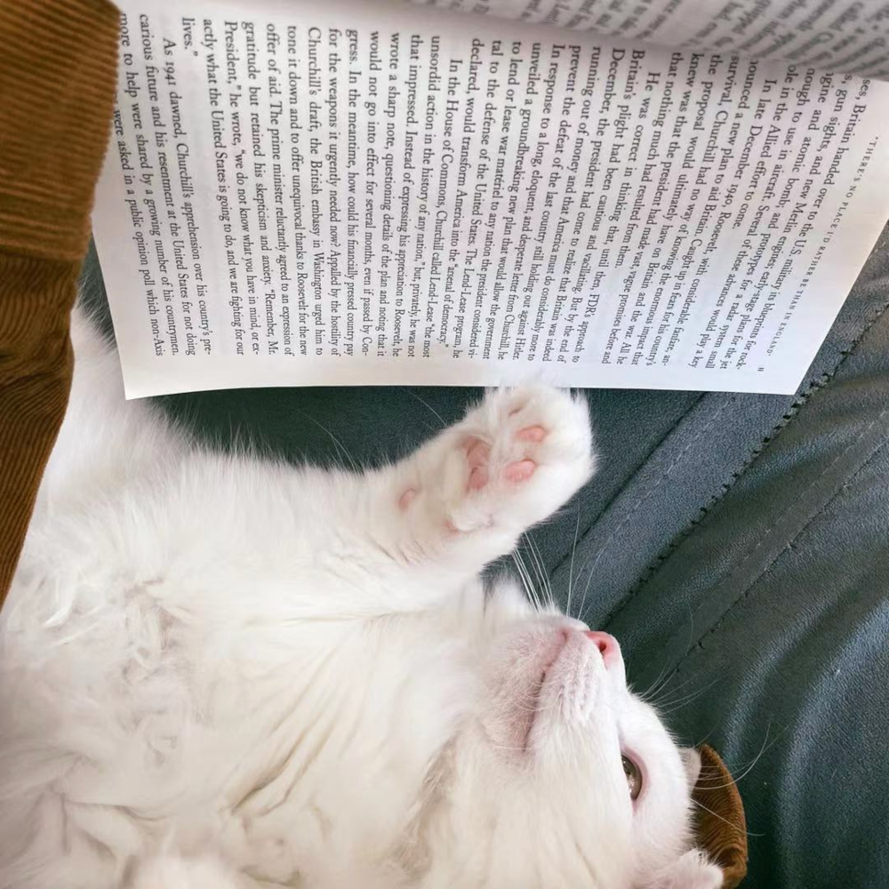
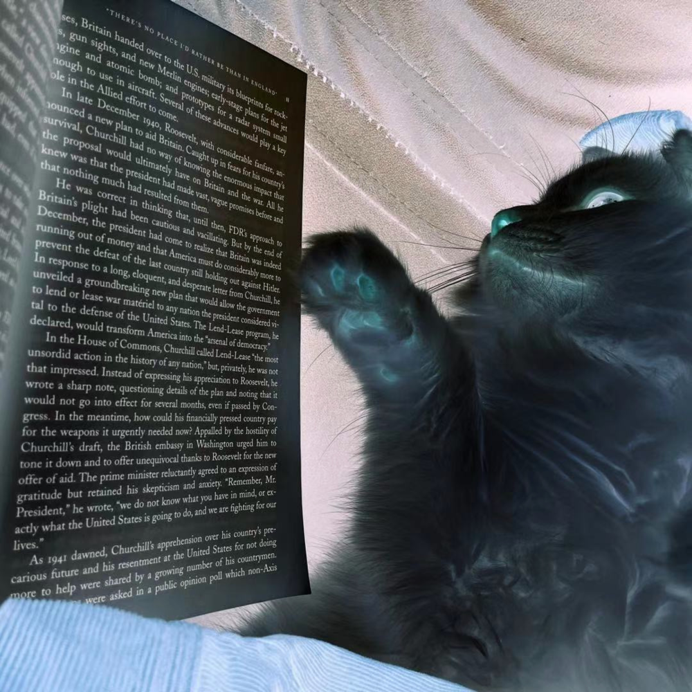
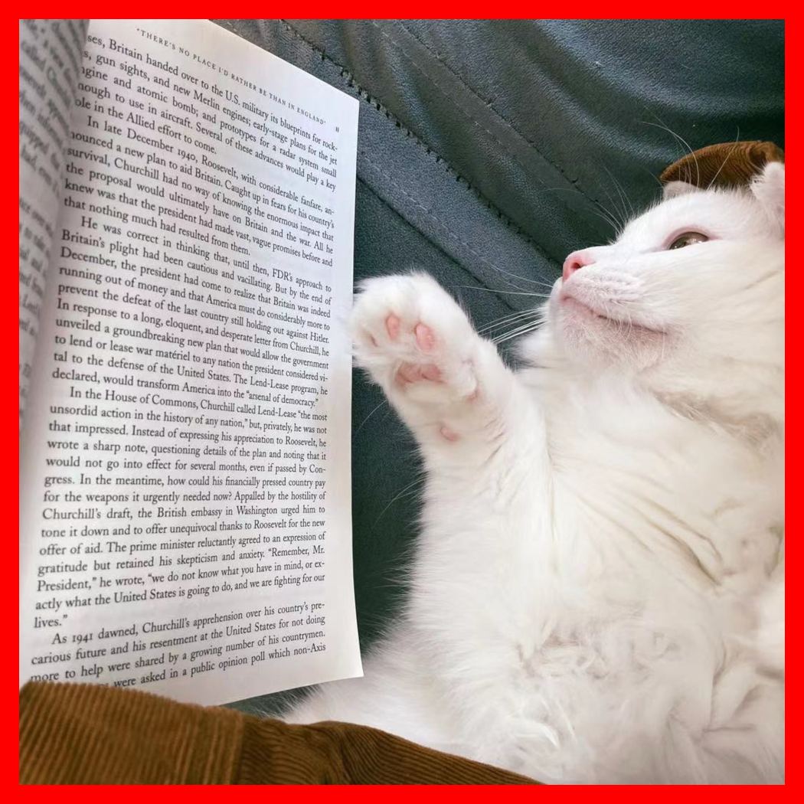
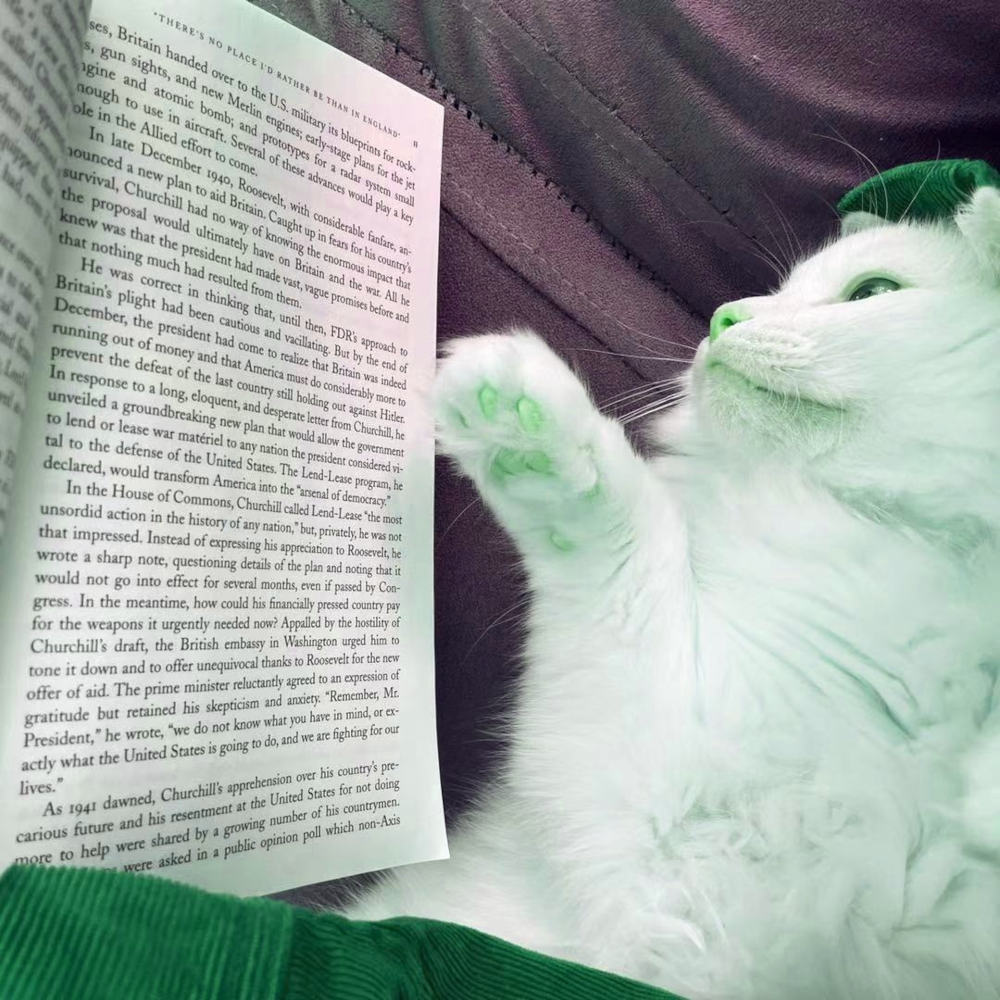

# pixmap-ops

Image manipulation demos based on the PPM image format.

TODO: Add a representative image for your project here

## How to build

*Windows*

Open git bash to the directory containing this repository.

```
pixmap-ops $ mkdir build
pixmap-ops $ cd build
pixmap-ops/build $ cmake -G "Visual Studio 16 2019" ..
pixmap-ops/build $ start Pixmap-Ops.sln
```

Your solution file should contain two projects: `pixmap_art` and `pixmap_test`.
To run from the git bash command shell, 

```
pixmap-ops/build $ ../bin/Debug/pixmap_test
pixmap-ops/build $ ../bin/Debug/pixmap_art
```

*macOS*

Open terminal to the directory containing this repository.

```
pixmap-ops $ mkdir build
pixmap-ops $ cd build
pixmap-ops/build $ cmake ..
pixmap-ops/build $ make
```

To run each program from build, you would type

```
pixmap-ops/build $ ../bin/pixmap_test
pixmap-ops/build $ ../bin/pixmap_art
```

## Image operators

Below documents six additional operators and example images, the original
image used is shown below:


* Rotate 90 degrees\
  `ppm_image rotate()`
  

* Invert the image\
  `ppm_image invert();`
  

* Add a border around the image with given color and width\
  `ppm_image border(const ppm_pixel &color, int width);`
  

* Apply n * n box blur\
  `ppm_image box_blur(int n);`
  

* Shift colors in each pixel of the image (R->G, G->B, B->R)\
  `ppm_image swirl_color();`
  

* Overlay the image with the given color\
  `ppm_image overlay(ppm_pixel color);`
  

## Results

TODO: Show artworks using your class

